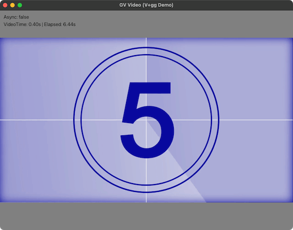

# v_gvvideo



GV Video ([Extreme Gpu Friendly Video Format](https://github.com/Ushio/ofxExtremeGpuVideo)) Decoder for V-lang 

Compressed texture GPU streaming is supported (DXT1/DXT3/DXT5). You can also use alpha channel (opacity).

Ported from [go-gv-video](https://github.com/funatsufumiya/go-gv-video/)

> [!WARNING]
> V port was almost done by GitHub Copilot. Use with care.

## Dependencies

- [v-lz4](https://github.com/funatsufumiya/v-lz4/)
- [v_dxt_decoder](https://github.com/funatsufumiya/v_dxt_decoder/)

## Install

```bash
$ git clone https://github.com/funatsufumiya/v_gvvideo ~/.vmodules/gvvideo
```

## Test

```bash
$ v test ~/.vmodules/gvvideo
```

## Example (using gg)

> [!NOTE]
> works without `-prod` option, but maybe slower fps

```bash
$ v -prod run ~/.vmodules/gvvideo/examples/single/main.v

# with your gv file
$ v -prod run ~/.vmodules/gvvideo/examples/single/main.v [gv-file-path]

# with your multiple gv files
$ v -prod run ~/.vmodules/gvvideo/examples/multiple/main.v [dir-containing-gv-files]
```
